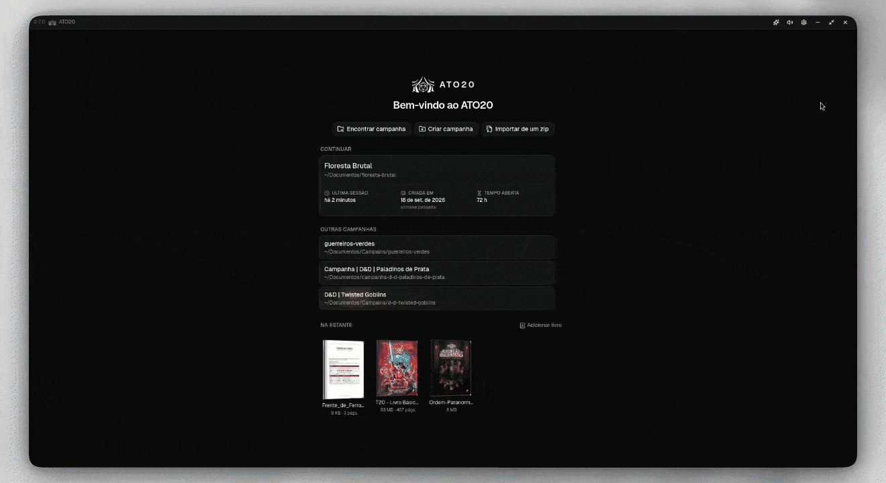

<div align="center">

<picture>
  <source media="(prefers-color-scheme: dark)" srcset="src/assets/logo-white.png">
  
</picture>

# ATO20

[Português](README.md) · **English**

ATO20 is an open source VTT (*virtual tabletop*) built to make organizing and running
tabletop RPG campaigns easier. At the table, advanced camera control brings real immersion to
the players; away from it, the GM keeps the documents up to date and the story organized in
one place.

</div>

Made for in-person play: the GM builds the next scene on the laptop while the table keeps
watching the current one on the spectator window, and every player follows along on their
own phone.

**A personal project.** A desktop app, with no server and no account.



## Download

On Linux, the AppImage runs without installing anything:

```bash
curl -fL -o ato20.AppImage https://github.com/ato20-org/ato20/releases/download/v1.2.0/ato20_1.2.0_amd64.AppImage && chmod +x ato20.AppImage
./ato20.AppImage
```

On Windows, from PowerShell:

```powershell
wget https://github.com/ato20-org/ato20/releases/download/v1.2.0/ato20_1.2.0_x64-setup.exe -OutFile ato20-setup.exe
.\ato20-setup.exe
```

The other formats (`.deb`, `.rpm` and `.msi`) are on the
[releases](https://github.com/ato20-org/ato20/releases) page. PowerShell 7 and a command that
does not go stale with every version are in [Install](docs/instalar.md) (in Portuguese).

If the app is already installed you need none of this: **from 0.1.0 on it tells you on its
own** when a new version is out.

The interface speaks Portuguese and English. It follows the system language, and you can
switch it in Settings → General.

## Why

ATO20 was made as a thank-you to the tabletop RPG community. The idea is a simple tool that
reaches from the simplest table to the most complex one.

The scene **being edited** and the scene **on air** are separate. That is what lets the GM
prepare the next one while the table stays on the current one.

The campaign lives on disk because of a cost that stalled the previous version, which kept
maps and music in Supabase Storage: a large campaign fills up the free plan, and the way out
would be paying for a server per user or piling up compression to fit. On the disk of whoever
runs the table that cost does not exist, and the limit becomes the hard drive.

## Three screens

| Screen | Where it runs | What it is |
| --- | --- | --- |
| GM | **in the app** | The GM's screen: builds scenes, drags images in, hides regions, decides what goes on air |
| Spectator | browser | Just the stage, no controls. Opens on any screen with a browser: TV, monitor, projector, another laptop |
| Player | browser | Each player's phone |

Why the GM is the app and the other two are the browser is in
[Three screens](docs/telas.md) (in Portuguese).

## Beyond the table

A campaign is more than what goes to the spectator window. The **board** is a sheet with no
floor for the GM to think on: text straight on the sheet, arrows that follow what you move,
sticky notes, images, dice and cards in one place. A **note** is Markdown with live preview,
and `@`, `/` and `>` call up references, commands and quotes.

The **Files** tab puts boards, notes and images in the same folder tree, and a note is a
campaign file: a card on a board only points to it, so the same note shows up on two boards
without becoming two copies. Putting a board on air shows the whole sheet on the spectator
window and on the phones.


## What already works

- **GM: complete.** Opens the folder, saves scenes, sends images and sounds.
- **Spectator and Player: on the local network.** The daemon serves both screens and
  publishes the scene over SSE, so any device in the house can be the spectator window and
  every player follows along on their phone.
- **Character sheet: on the Player screen.** Name, notebook and attachments, with one token
  per player in place of the RLS that did this job before.
- **The phone plays.** The player sees the character linked to them (inventory, attachments
  and the meters the GM did not hide), rolls dice on the table and moves their own
  character's token. The daemon rolls the dice, not the device of whoever benefits from them.
- **Zip export and import: done.** A campaign fits in one file, and the file opens on any
  other machine, with the table still working.
- **Flathub: the package builds, and has not been submitted yet.** The manifest is in
  `empacotar/flatpak/` and builds a Flatpak that opens and runs; what is left is the
  submission.

## Philosophy

**The camera belongs to the storyteller.** Each scene keeps named cameras, and going on air
is picking one: the spectator window fades over and follows the movement without jolts, and
holding V turns the GM's mouse into a camera operator. The table sees the framing, and the GM
also sees what it has not seen yet.

**A campaign is a folder.** The model is Obsidian's: you point the app at a folder, and that
folder is the campaign. Moving to another machine is copying the folder.

**No login, no GM account.** Whoever opened the program is already on the machine where the
campaigns live, and a password there would only protect the disk from itself.

**Text where possible.** `git diff` on a scene shows the token that moved, and a
`config.json` opened in the editor tells what the campaign is.

**The table is the home network.** The spectator window and the phones open in the browser,
served by the daemon that runs inside the app. No outside server takes part in the session.

**What the table does not see does not leave the machine.** A hidden meter, a hidden item and
the villain nobody has seen are filtered in the daemon, not on screen: no filtering on screen
fixes what has already arrived.

**Plugins, like in an editor.** A theme is a CSS file; a plugin is a folder with a
`manifest.json` that declares what it adds, and the Plugins screen lists what each plugin
does without running a line of its code.

**Measured, not deduced.** Performance is decided on the real engine, WebKitGTK included,
and repeated before it is believed.

## Documentation

| | |
| --- | --- |
| [Plugins](docs/en/plugins.md) | Themes, feature plugins and the API |

The rest of the documentation is in Portuguese:

| | |
| --- | --- |
| [Instalar](docs/instalar.md) | Install: PowerShell 7, the command that follows new versions, the other formats |
| [A campanha](docs/campanha.md) | The campaign: the folder inside, how it saves, library folders, export and import |
| [Três telas](docs/telas.md) | Three screens: GM, Spectator and Player, and why each runs where it does |
| [O daemon](docs/daemon.md) | The daemon: routes, the table code, the write token |
| [Jogadores](docs/jogadores.md) | Players: table and sheet, the token in place of RLS, attachments |
| [Retratos de personagem](docs/retratos.md) | Character portraits: the portrait tied to the camera, and the live portrait |
| [Desenvolvimento](docs/desenvolvimento.md) | Development: running, measuring, how it is built, tests |
| [Empacotar](docs/empacotar.md) | Packaging: the packages, the icon and the Flatpak |

## Contributing

Coming soon.

## License

MIT. The text is in [LICENSE](LICENSE).

Permissive on purpose. What a license would defend here is someone running the project as a
closed service, and that scenario does not exist: the daemon listens on the home network of
whoever runs it, and there is nothing to host. Copyleft would cost contributors and leave
third-party plugins in the gray zone of derivative work, which is exactly what we want to
see appear.
